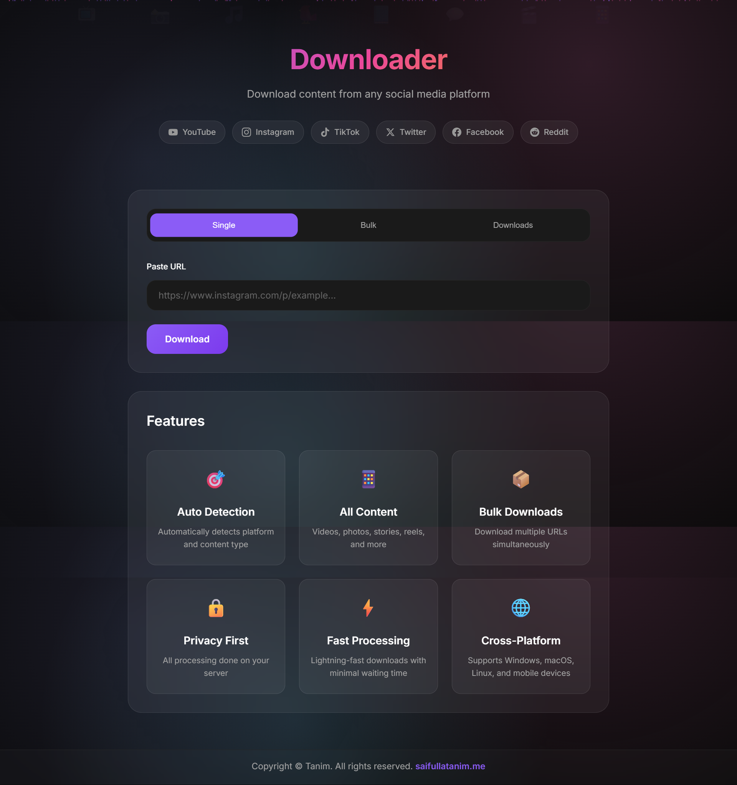
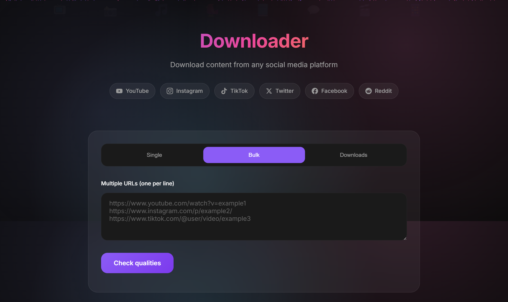
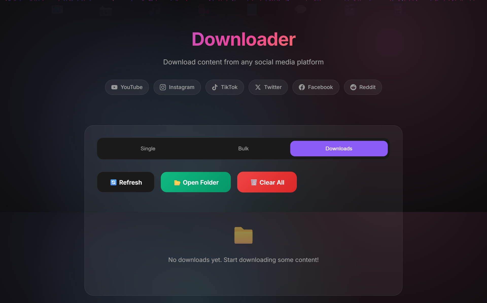
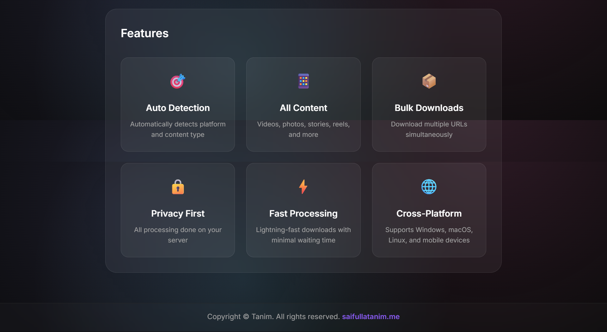

# 🚀 Videos Downloader

<div align="center">

A modern Flask-based social media downloader with bulk workflows, live progress tracking, quality selection, and platform-aware extraction.

<br>


</div>

---

# ✨ Preview

<div align="center">

| 🏠 Home Interface | 📦 Bulk Downloader |
|---|---|
|  |  |

| 📂 Downloads Manager | ⚡ Features Section |
|---|---|
|  |  |

</div>

---

# 📌 Features

## 🎯 Core Features

- ✅ Single URL video/audio download
- ✅ Bulk download workflow support
- ✅ Live progress tracking
- ✅ Download speed & ETA monitoring
- ✅ Multiple quality selection
- ✅ Thumbnail & title preview
- ✅ Platform-aware extraction system
- ✅ Responsive modern UI
- ✅ Docker deployment support
- ✅ Render deployment ready

---

# 🌐 Supported Platforms

- ▶️ YouTube
- 🎵 TikTok
- 📸 Instagram
- 📘 Facebook
- 🐦 Twitter/X
- 🎬 Vimeo
- 🔗 And many more via `yt-dlp`

---

# 🛠️ Tech Stack

| Technology | Purpose |
|---|---|
| Python | Backend Language |
| Flask | Web Framework |
| yt-dlp | Media Extraction |
| Instaloader | Instagram Support |
| Gunicorn | Production Server |
| Docker | Container Deployment |
| HTML/CSS/JS | Frontend UI |

---

# 📂 Project Structure

```text
Videos-Downloader/
│
├── app.py
├── requirements.txt
├── Procfile
├── Dockerfile
├── .gitignore
│
├── templates/
├── static/
├── scripts/
├── image/
│
└── downloads/           # Temporary runtime downloads

# ⚙️ Prerequisites

Before running locally, make sure you have:

- Python 3.10+
- Git
- Stable Internet Connection
- FFmpeg (Recommended)

---

# 💻 Local Setup

## 1️⃣ Clone Repository

```bash
git clone https://github.com/saifullahtanim/Videos-Downloader.git
cd Videos-Downloader
```

---

## 2️⃣ Create Virtual Environment

### Windows PowerShell

```powershell
python -m venv .venv
Set-ExecutionPolicy -Scope Process -ExecutionPolicy RemoteSigned
.\.venv\Scripts\Activate.ps1
```

### Linux/macOS

```bash
python3 -m venv .venv
source .venv/bin/activate
```

---

## 3️⃣ Install Dependencies

```bash
pip install --upgrade pip
pip install -r requirements.txt
```

---

# ▶️ Run the Application

```bash
python app.py
```

Open your browser:

```text
http://127.0.0.1:5000
```

---

# 🌍 Environment Variables

| Variable | Default | Description |
|---|---|---|
| PORT | 5000 | Application Port |
| DEBUG | False | Debug Mode |
| DOWNLOAD_DIR | /tmp/downloads | Download Location |

## Example

```powershell
$env:DEBUG="False"
$env:DOWNLOAD_DIR="/tmp/downloads"
python app.py
```

---

# ☁️ Deploy to Render

## Step 1 — Push to GitHub

```bash
git add .
git commit -m "Initial deploy"
git push origin main
```

---

## Step 2 — Create Render Web Service

1. Login to Render
2. Create a new **Web Service**
3. Connect GitHub repository
4. Select branch `main`
5. Deploy

---

## Step 3 — Start Command

```text
gunicorn --bind 0.0.0.0:$PORT app:app
```

---

## Step 4 — Environment Variables

```text
DOWNLOAD_DIR=/tmp/downloads
DEBUG=False
```

---

# 🐳 Docker Deployment

## Build Docker Image

```bash
docker build -t videos-downloader .
```

## Run Container

```bash
docker run -e PORT=8080 -p 8080:8080 videos-downloader
```

---

# 📈 Workflow Overview

```text
User URL
   ↓
Flask Backend
   ↓
yt-dlp Extraction
   ↓
Quality Selection
   ↓
Download Processing
   ↓
User Download
```

---

# 🧪 Troubleshooting

## ❌ Application Not Starting

```bash
python app.py
```

---

## ❌ Missing Packages

```bash
pip install -r requirements.txt
```

---

## ❌ Git Push Rejected

```bash
git pull origin main --allow-unrelated-histories
git push origin main
```

---

# ⚠️ Important Storage Note

On local environments, downloads are stored in:

```text
downloads/
```

On Render Free Tier and most cloud platforms:

- Storage is temporary (ephemeral)
- Files may be removed automatically
- Recommended production approaches:

## Recommended Solutions

1. Stream files directly to users
2. Delete temporary files after download
3. Use cloud object storage:
   - AWS S3
   - Backblaze B2
   - Cloudflare R2

---

# 🔄 Git Workflow

```bash
git add .
git commit -m "Update project"
git push origin main
```


---

# 🤝 Contributing

Contributions are welcome.

If you'd like to improve the project:

1. Fork the repository
2. Create a new branch
3. Make your changes
4. Submit a Pull Request

---

# 📜 Disclaimer

This project is intended for educational and personal use only.

Users are responsible for:

- Following platform Terms of Service
- Respecting copyright laws
- Legal and ethical usage

---

# ⭐ Support

If you found this project useful:

- ⭐ Star the repository
- 🍴 Fork the project
- 🛠️ Contribute improvements
